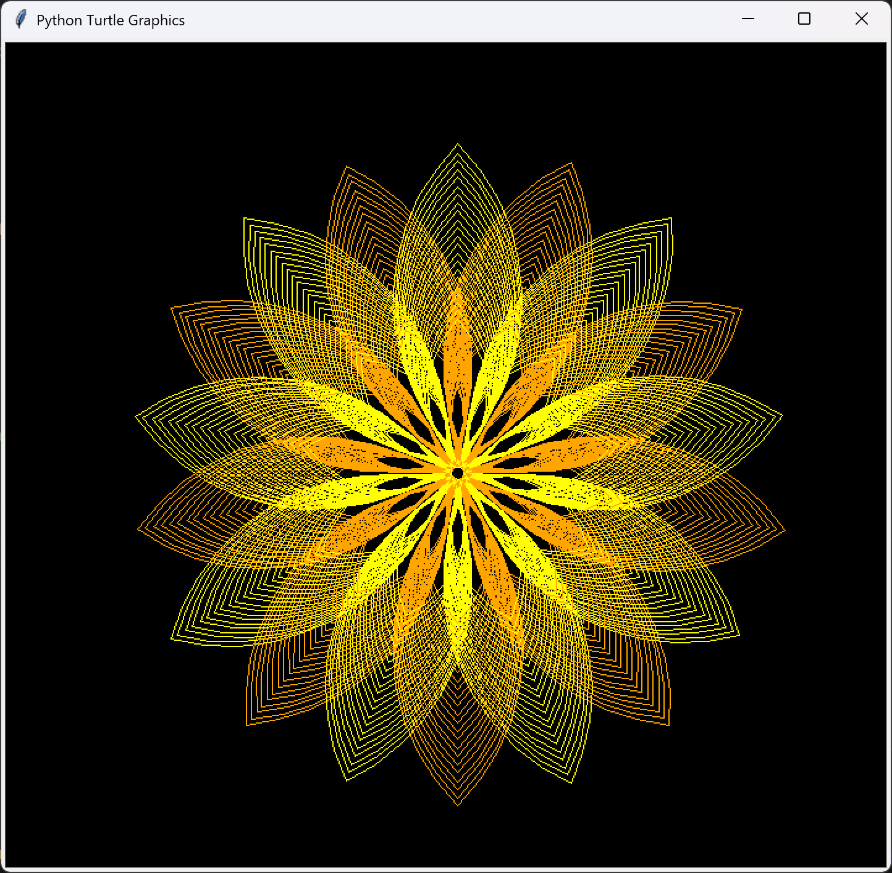

## Ray's first Python
 
Hello! I’m a beginner coder who primarily uses Python.

This repo will have some Turtle codes I made and some simple projects. 

They're pretty basic and lacking in many ways, but please be gentle with them~ 😊

By the way, I'm Korean. I can't use English as well as Korean. 😳

I'd appreciate it if you could understand my poor English. 
Please add honest comments on the code, too. 
GitHub is a mysterious world for me. 😲
I'm getting used to it more and more. 

I'm not good enough. 
I need your advice

I have been studying Python for 5 months. 
Please understand my stupid code generously. 

Please help me a lot. 

Thank you. Have a happy day 

### lion.py

### flower.py

